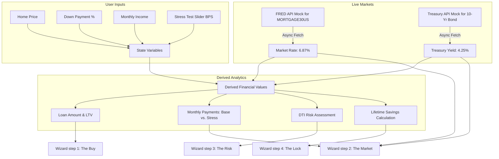

# Mortgage Rate-Lock Simulator Explainer

Welcome to the **Mortgage Rate-Lock Simulator** developer guide and domain knowledge explainer. This live document outlines the application architecture, mathematical core logic, debt-to-income (DTI) assessment logic, and external dependencies.

---

## 1. Architecture & Data Flow

The application is structured as a high-fidelity React Single Page Application (SPA) driven by a 4-step wizard flow. The overall data lifecycle is managed using React component state and computed values to ensure reactive UI updates and mathematical precision.

### Steps in the Wizard Flow
1. **Step 1: The Buy:** Receives basic financials (`homePrice`, `downPaymentPct`, `monthlyIncome`). It computes `loanAmount` and `ltv` in real-time.
2. **Step 2: The Market:** Automatically fetches simulated live indicators from the **Federal Reserve Economic Data (FRED)**: the 30-Year Fixed Mortgage Rate (`MORTGAGE30US`) and the 10-Year Treasury Yield. It computes the **Spread** in Basis Points (BPS).
3. **Step 3: The Risk:** Features an interactive slider enabling the user to stress test their affordability against interest rate hikes (from 0 to +150 bps). It dynamically compares monthly P&I payment variations and triggers a high-visibility DTI Risk alert if the monthly payment increase exceeds 10% of their monthly income.
4. **Step 4: The Lock:** Aggregates and visualizes the financial impact (Monthly Savings vs. Lifetime Interest Savings) if they lock their mortgage rate today. It features a Recharts bar chart comparing the two payment outcomes and triggers a canvas-confetti animation upon locking the rate.

---

## 2. Core Logic & Mathematical Formulas

The financial calculations in the application utilize the following standard retail banking equations:

### 2.1 Loan-to-Value (LTV) Ratio
$$LTV = 100\% - \text{Down Payment }\%$$

### 2.2 Amortization Math (Monthly P&I Payment)
To ensure absolute mathematical accuracy, we calculate the Monthly Principal & Interest (P&I) payment using the standard amortization formula:
$$M = P \frac{i(1+i)^n}{(1+i)^n - 1}$$

Where:
* $M$ = Monthly payment
* $P$ = Principal loan amount ($\text{Home Price} - \text{Down Payment Amount}$)
* $i$ = Monthly interest rate ($\frac{\text{Annual Interest Rate}}{12 \times 100}$)
* $n$ = Number of monthly periods ($360$ for a standard 30-year fixed loan)

### 2.3 The "Spread" & Basis Points (BPS)
* **Basis Points (BPS):** The standard unit of measure for interest rates in financial services. 
  $$1\% = 100 \text{ BPS} \quad \text{and} \quad 1 \text{ BPS} = 0.01\%$$
* **The Spread:** The risk premium that retail mortgage lenders charge above the risk-free rate of return. It is computed as:
  $$\text{Spread (BPS)} = (\text{Mortgage Rate} - \text{10-Year Treasury Yield}) \times 100$$

### 2.4 Debt-to-Income (DTI) Qualification Risk
Lenders use DTI ratios to determine if a borrower qualifies for a mortgage. In this application, we simulate a stress test risk assessment:
$$\text{Qualification Risk} = \text{True} \iff (\text{Projected Payment} - \text{Current Payment}) > (0.10 \times \text{Monthly Income})$$
If the payment increase resulting from a market rate hike exceeds **10% of the applicant's monthly income**, we flag it in high-contrast rose red as a **DTI Qualification Risk**.

---

## 3. Dependencies & Integrations

The simulator relies on a lightweight, modern FinTech web stack:

| Dependency | Purpose | Details |
| :--- | :--- | :--- |
| **React** | Component lifecycle and UI State | Manages interactive steps and input states. |
| **Vite** | Bundling and Development Server | Compiles fast TS/TSX modules. |
| **Tailwind CSS** | Styling | Provides the premium dark-mode dashboard UI. |
| **Framer Motion** | Micro-animations and transitions | animates the multi-step Wizard screen changes. |
| **Recharts** | Data visualization | Draws the high-contrast bar chart comparing payments. |
| **Lucide React** | Icons | Renders modern typography iconography. |
| **Canvas Confetti** | Delight effects | Triggers a confetti burst upon successful rate lock. |

---

## 4. Updates & Synced Features
This explainer remains synchronized with code changes. 
* *May 20, 2026:* Fixed strict TypeScript compiler warnings by resolving unused imports and parameters in `App.tsx` and `About.tsx`, achieving a clean 100% compile rate for production.
* *May 20, 2026:* Configured Vite base-path to `/Mortgage-Rate-Lock-Simulator/` and updated static hero image references to relative paths for flawless deployment and asset loading on GitHub Pages.
* *May 20, 2026:* Created `.github/workflows/deploy.yml` to automate dependency fetching, production building via `pnpm`, and artifact deployment to GitHub Pages upon pushing to the `main` branch.
